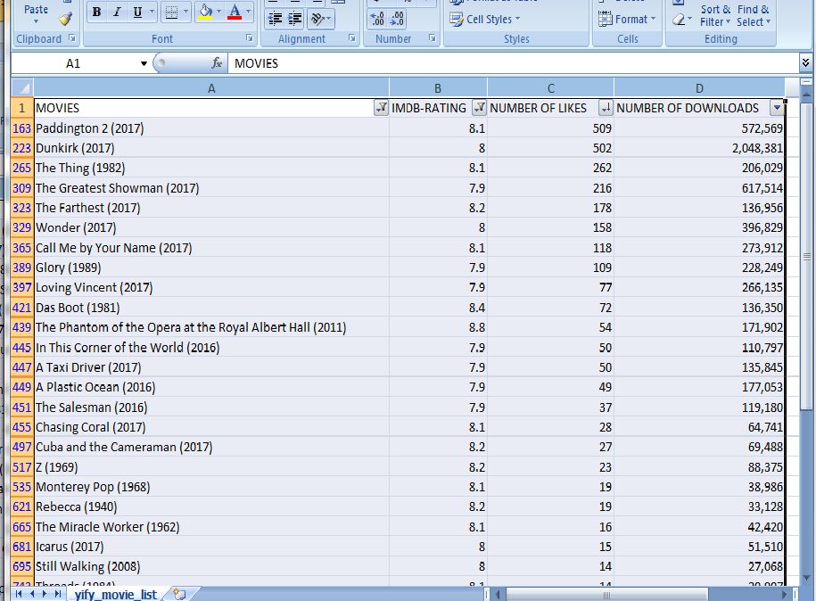
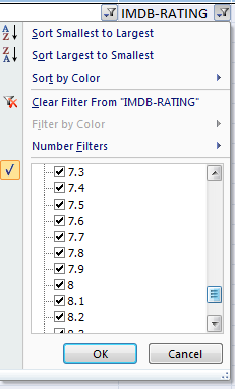

# yts.am_scraper_
This is a Python script to scrape all the available movie torrent names wih their respective IMDB score, number of likes and number of downloads from yts.am so that we can filter out better movies from the site. Yts.am do not have good search and filter tools. This script saves the data in a csv file and hence enable the user to open it in any spreadsheet software and filter the data

***UPDATE :*** The script can now scrape IMDb movie links and 720p and 1080p torrent links. Also it can now handle movies which have special charachters in their names.

**NOTE :** If yts.am(Yify movies) is blocked at your place, first connect the internet to a VPN and then run the script.

# Screenshots

__We can apply filters to the data__

## Prerequisites
This script needs two external dependencies  
- beautfulsoup4
- requests

To install all the requirements, go to the code directory and run the following in command prompt;

`pip install -r requirements.txt`

## Getting Started
The main executable file is `yify_browse.py`
Change to the code directory in command prompt and run 

`python yify_browse.py`

To download all the Torrents at a strech run 

`python downloadlinks.py`

**Note :** all the torrent files will be downloaded to the browser(default) downloads path

**Warning :** The script will scrape a large amount of data and if you do not want it to be displayed on your prompt, you can comment out the print statements in the code. Data will be saved in csv file after the execution is complete.

## Built With
- [python 3.6](https://www.python.org) 
- [requests](http://docs.python-requests.org/en/master/#)
- [Beautifulsoup4](https://www.crummy.com/software/BeautifulSoup/bs4/doc/)
